# 🚀 todoList_Django_to_DRF

이 프로젝트는 Django 기반 Todo 애플리케이션을 시작으로
Django REST Framework, JWT 인증, PostgreSQL 전환,
AI 모델 연동(Hugging Face), Redis/Celery 비동기 처리까지
단계적으로 확장하는 풀스택 학습 프로젝트입니다.

---

## 📌 프로젝트 목표

- Django MVT 구조 이해
- DRF 기반 API 설계
- 인증(JWT) 시스템 구축
- 데이터베이스 전환(SQLite → PostgreSQL)
- 외부 데이터 수집 및 적재
- AI 모델 연동
- Redis/Celery 기반 비동기 처리
- 실무형 프로젝트 구조 설계

---

## 🧭 전체 개발 로드맵

### 1️⃣ Django 기본 세팅
- 가상환경 설정 (uv)
- pre-commit 설정 (black, isort, flake8)
- Todo CRUD 구현

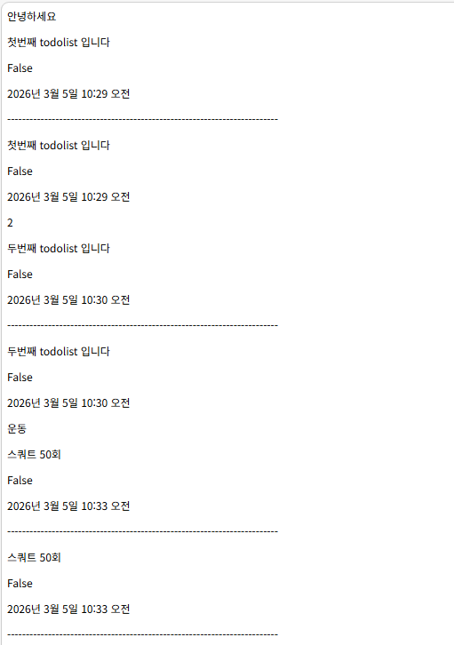

### 2️⃣ Generic View 기반 CRUD
- CBV 기반 구조 설계
- Django Template 렌더링
# create

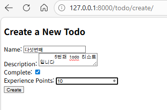

# detail

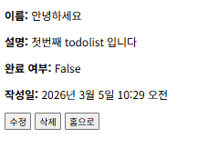

# update

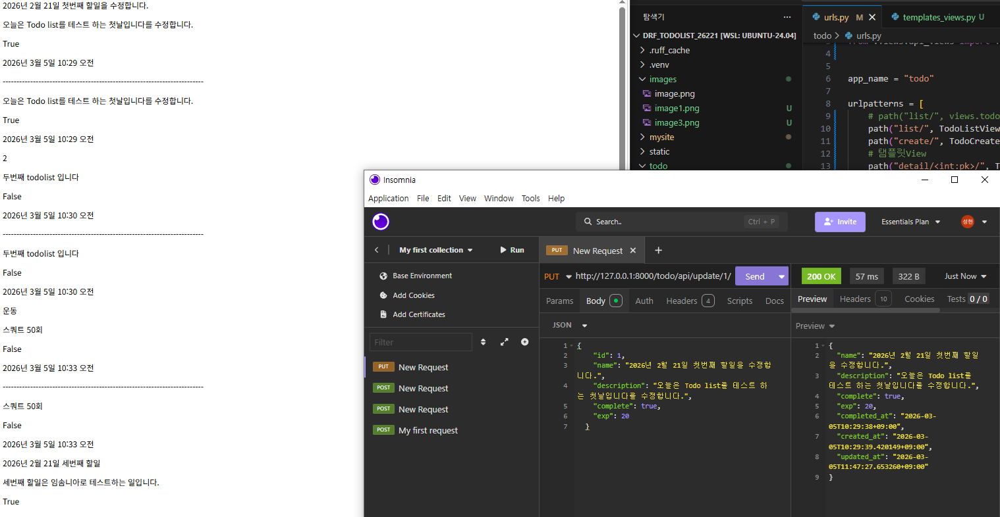
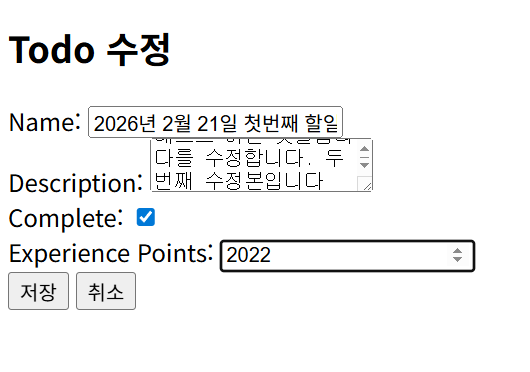
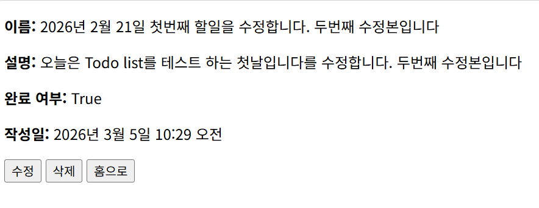

# delete
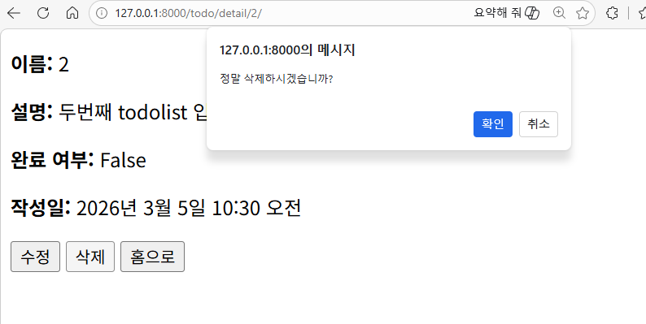
### 3️⃣ DRF ViewSets로 API 전환
- Serializer 설계
- API 응답 구조 설계

### 4️⃣ 환경 변수 설정 (.env)

### 5️⃣ Pagination 추가
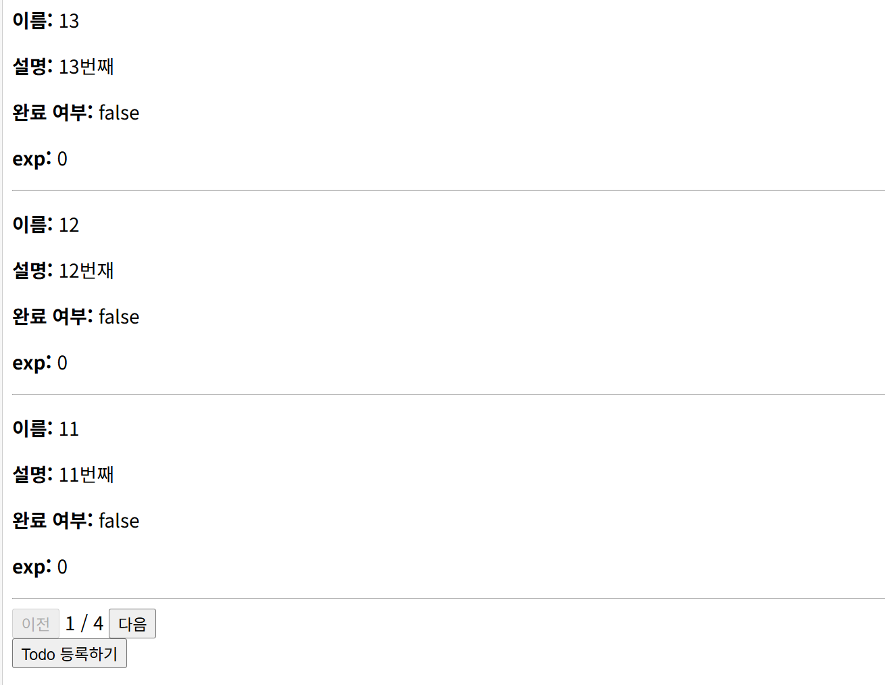

### 6️⃣ 이미지 업로드 기능 추가
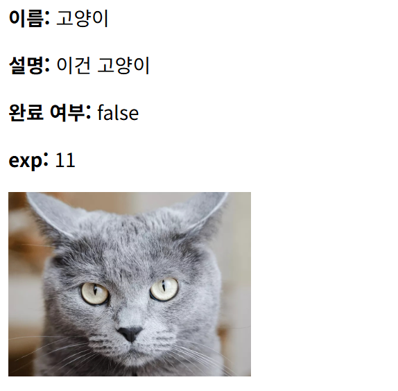

### 7️⃣ 회원가입 / 로그인 기능 구현
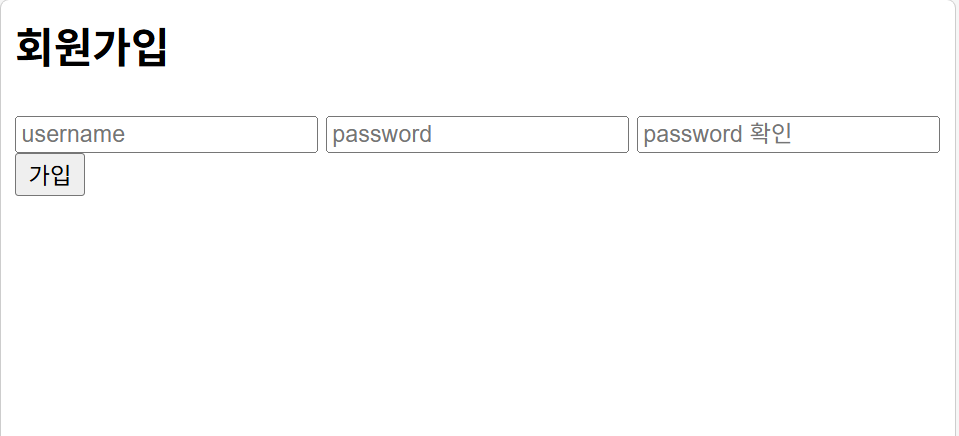

# 회원가입 > 로그인
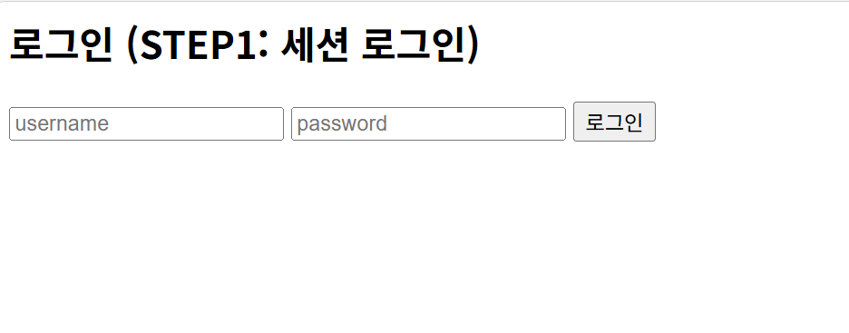
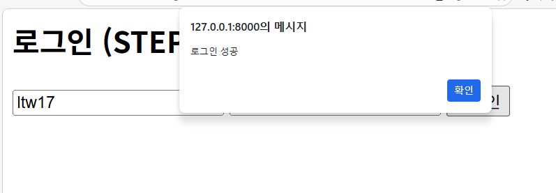

### 8️⃣ 템플릿 구조 정리
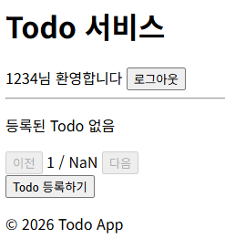

### 9️⃣ JWT 인증 도입
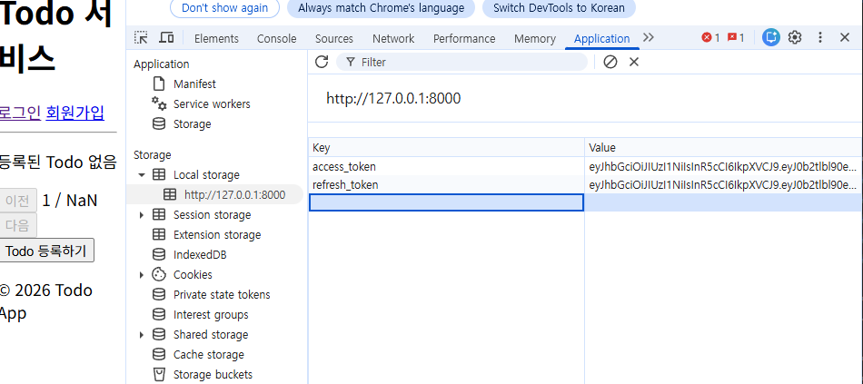

# 네트워크 부분
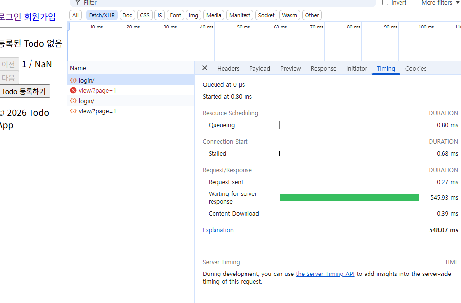

### 🔟 인터랙티브 기능 추가 (Ajax / Axios)
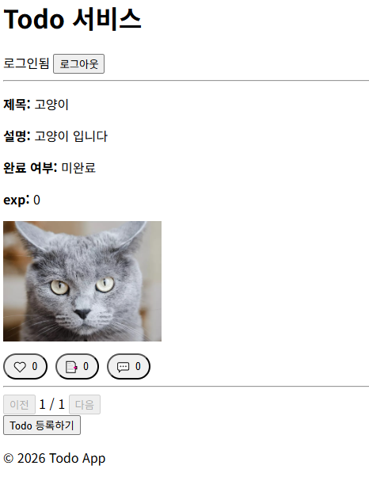

### 1️⃣1️⃣ CSS 및 UI 정리

### 1️⃣2️⃣ 다른 사용자 글 조회 기능

### 1️⃣3️⃣ SQLite → PostgreSQL 전환

### 1️⃣4️⃣ 웹 크롤링 → CSV / JSONL 데이터 정제

### 1️⃣5️⃣ DBeaver → DRF 데이터 적재

### 1️⃣6️⃣ DRF에 Hugging Face 모델 연동

### 1️⃣8️⃣ Redis + Celery 비동기 처리 및 캐시 적용

---

## 🛠 사용 기술

### Backend
- Python
- Django
- Django REST Framework

### Database
- SQLite3 (개발 초기)

<!-- ### AI / Data
- Hugging Face
- Pandas
- CSV / JSONL 데이터 처리   -->

<!-- ### Async / Cache
- Redis
- Celery   -->

### Frontend
- Django Template
- HTML5 / CSS3
- JavaScript
- Axios

### DevOps
- Git / GitHub
- pre-commit
- Docker (예정)
- AWS EC2 (예정)

---

## 📂 프로젝트 구조

DRF_todoList_26221/
├── mysite/ # Django 프로젝트 설정
├── todo/ # Todo 앱
├── templates/
├── static/
├── manage.py
├── requirements.txt
└── .pre-commit-config.yaml


---

## ⚙ 실행 방법

```bash
uv venv
source .venv/bin/activate
uv pip install -r requirements.txt

python manage.py migrate
python manage.py runserver

---

## 📈 확장 방향

- REST API 기반 프론트엔드 분리
- Docker 기반 배포
- CI/CD 구성
- AI 추천 기능 확장
- 모니터링 시스템(Prometheus/Grafana)


---

## 🎯 프로젝트 성격

이 프로젝트는 단순 Todo 앱이 아닌
"실무 확장형 Django → DRF → AI → 비동기 구조 학습 프로젝트"입니다.


## 2026-03-05 (3)
- feat : CRUD, API CRUD 작성 및 test코드 작성
- fix : viewset 기반 api crud로 변환 axios 사용
- docs : README 작성
- test : tests_crud, tests_viewset_crud 작성 완료


## 2026-03-05 (4)
- feat : 페이지 네이션 추가 및 작동 확인
- fix : todo/pagination.py 생성, templates_views.py > listview 경로 변겅 (todo/list.html 로 변경), .evn 작성
- docs : README 작성

## 2026-03-05 (5)
- feat : 이미지 업로드 기능 추가
- fix : serializers.py image 필드 추가, CI django-environ 패키지 누락 수정
- docs : README 작성

## 2026-03-05 (6)
- feat : 회원가입/로그인/로그아웃 기능 추가 (세션 기반 인증)
- feat : Todo 유저 소유 구조 변경 (내 것만 조회/수정/삭제)
- chore : accounts 앱 생성

## 2026-03-05 (7)
- feat : 템플릿 구조 정리 (base.html, auth_base.html, header.html, footer.html 분리)
- feat : 헤더 인증 상태 분기 (로그인/비로그인 UI 분리)
- refactor : axios CDN 중복 제거, base.html로 통합

## 2026-03-09 (8)
- feat : JWT 인증 방식 도입 (세션 → JWT 전환)
- feat : simplejwt 설치 및 settings.py 설정 (JWTAuthentication)
- feat : 로그인 API를 TokenObtainPairView로 교체 (access + refresh 토큰 발급)
- feat : static/js/api.js 생성 (공통 axios 인스턴스, Authorization 자동 부착)
- refactor : 전체 템플릿 세션 방식 제거, window.api 방식으로 전환
- refactor : CSRF 토큰 제거, withCredentials 제거

## 2026-03-09 (9)
- feat : interaction 앱 생성 (좋아요/북마크/댓글)
- feat : TodoLike, TodoBookmark, TodoComment 모델 추가
- feat : interaction/serializers.py, views.py, urls.py 생성
- feat : todo/serializers.py 확장 (like_count, is_liked, bookmark_count, is_bookmarked, comment_count, username)
- feat : TodoViewSet에 like/bookmark/comments action 추가
- refactor : TodoViewSet permission_classes AllowAny로 변경 (목록/상세 공개)
- feat : list.html 인터랙티브 UI 추가 (좋아요/북마크/댓글 버튼, 이벤트 위임)
